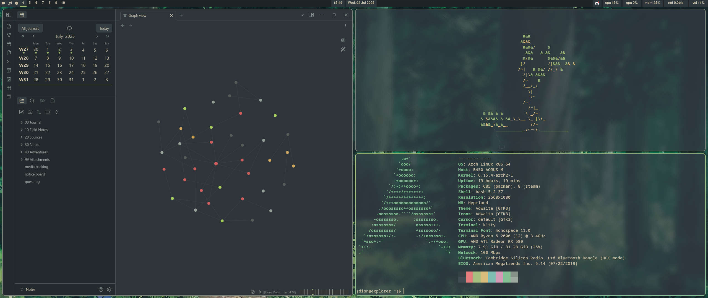

# dotfiles
My custom dotfiles that I use on my machine(s).

These dotfiles were made for an Arch Linux system with Hyprland. They are designed with me, and only me, in mind and are specific to my needs. Feel free to copy configs, but be warned that *here be dragons*.

## dependencies
- `hyprland`: wayland compositor
- `dunst`: notifications
- `hyprpaper`: wallpaper utility
- `hyprpolkitagent`: authentication agent
- `kitty`: terminal emulator
- `nemo`: file manager
- `pipewire`: audio
- `swayosd`: volume OSD
- `waybar`: status bar
- `wofi`: application launcher

